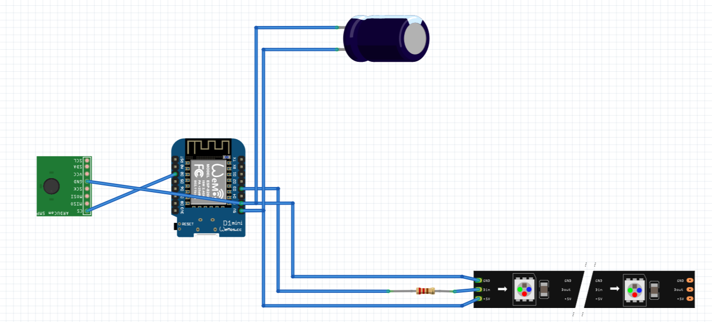

# water-meter-house-automation
ESP8266 software for an water meter measurement based on an ArduCAM, ESP8266 and WS2812-LED illumination

## Wiring / Components

### Components
- ArduCAM OV2640 with JPG-Output
- Node Mini D1 with ESP8266
- LED-Strip with WS2812b-Controller
- Capacity 1000uF
- Resistor 470 Ohm

### Wiring

